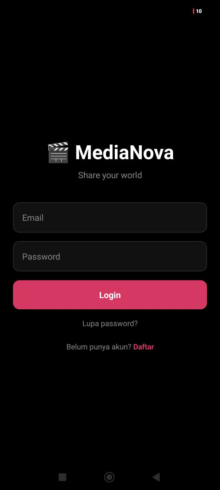
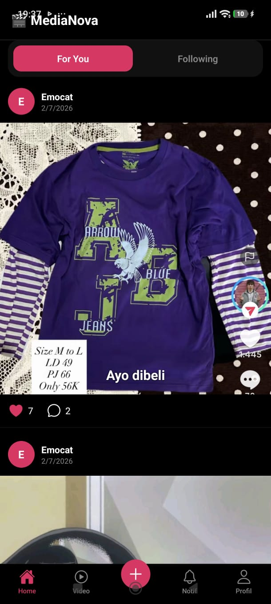
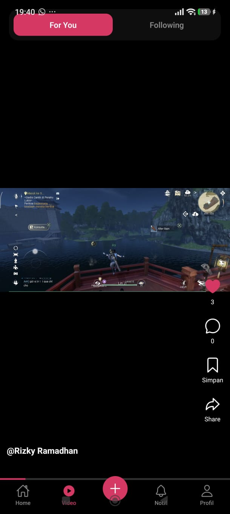
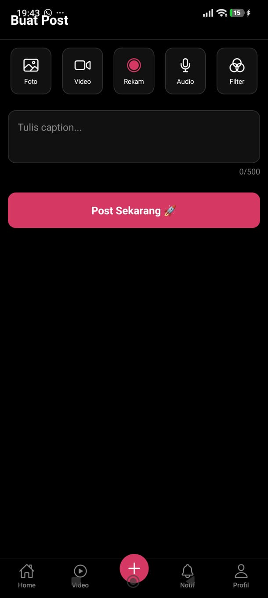
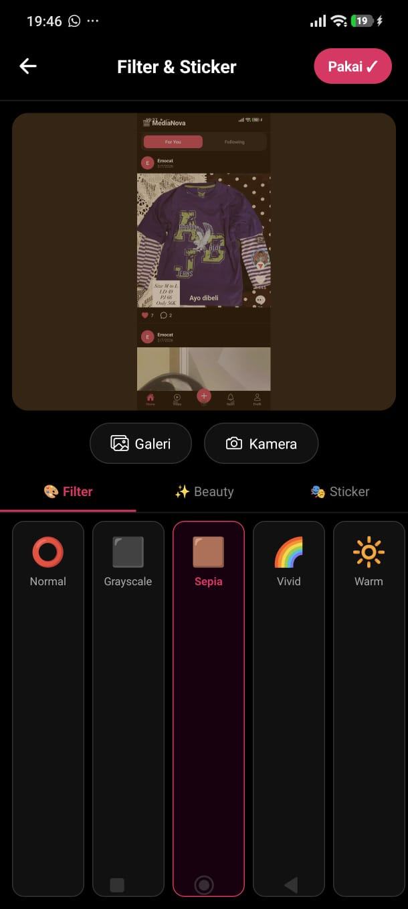
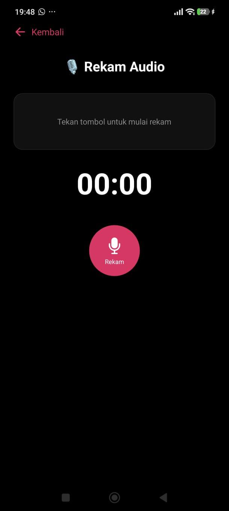
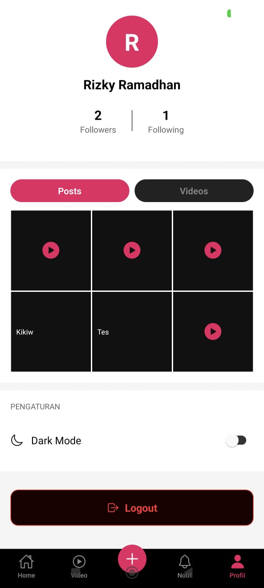

# 🎬 MediaNova - Social Media App

> **Tugas Besar Pemrograman Mobile Lanjut**  
> Kelompok 3 | Fokus: Rich Media Content — Video, Audio & Filters  
> D3 Sistem Informasi | UPN Veteran Jakarta | Semester V 2025/2026

---

## 📱 Tentang Aplikasi

MediaNova adalah aplikasi social media berbasis React Native yang berfokus pada konten multimedia kaya: video shorts, audio content, dan filter kamera. Aplikasi ini terinspirasi dari TikTok dan Instagram Reels dengan pendekatan media-first.

### Fitur Utama
- 🎬 **Video Shorts Feed** — Vertical scroll TikTok-style, auto-play/pause
- 🎙️ **Audio Content** — Record, waveform visualisasi, audio player dengan speed control
- 📷 **Camera Filters** — 6 filter warna + beauty filter + sticker overlay
- ✏️ **Text Overlay** — Tambah teks di foto/video dengan pilihan warna & posisi
- 👥 **Social Features** — Follow/Unfollow, Like, Comment
- 🔔 **Notifications** — In-app notification center
- 🌙 **Dark Mode** — Theme switching

---

## 👥 Anggota Kelompok

| Nama | NIM | Peran |
|------|-----|-------|
| [Rizky Ramadhan] | [2410501112] | Tech Lead / Mobile Dev |
| [Ananda Wirajaya] | [2410501111] | Frontend Dev |
| [Kirana Fitria Utami] | [2410501117] | Backend Dev |
| [Clara Ragil Dewanti] | [2410501116] | Media Specialist |
| [Ukhti Zahra Isyana] | [2410501130] | QA / DevOps |

---

## 🛠️ Tech Stack

### Framework & Core
- React Native + Expo SDK 54
- React Navigation v6 (Stack + Tab + Drawer)
- Zustand (State Management)
- TypeScript

### Backend & Database
- Firebase Authentication (Email/Password + Google Sign-In)
- Firebase Firestore (Database)
- Cloudinary (Media Storage — foto, video, audio)

### Media Libraries
- expo-video (Video playback)
- expo-camera (Camera recording)
- expo-av (Audio recording & playback)
- expo-image-manipulator (Filter kamera)
- expo-image-picker (Media picker)
- expo-media-library (Save to gallery)

### UI & Animation
- @expo/vector-icons (Ionicons)
- React Native Reanimated 2
- React Native Gesture Handler

---

## 📋 Prerequisites

Pastikan sudah terinstall:
- Node.js >= 18.0.0
- npm >= 9.0.0
- Expo Go app (di HP) atau Android Emulator
- Git

---

## 🚀 Cara Menjalankan App

### 1. Clone repository
```bash
git clone https://github.com/ramadhan-arch/MediaNova-App.git
cd MediaNova-App
```

### 2. Install dependencies
```bash
npm install --legacy-peer-deps
```

### 3. Setup environment
Buat file `.env` di root project:
```
# Firebase Config
FIREBASE_API_KEY=your_api_key
FIREBASE_AUTH_DOMAIN=your_auth_domain
FIREBASE_PROJECT_ID=your_project_id
FIREBASE_MESSAGING_SENDER_ID=your_sender_id
FIREBASE_APP_ID=your_app_id

# Cloudinary
CLOUDINARY_CLOUD_NAME=diwgfhoux
CLOUDINARY_UPLOAD_PRESET=medianova
```

### 4. Setup Firebase
1. Buka [console.firebase.google.com](https://console.firebase.google.com)
2. Buat project baru atau gunakan yang sudah ada
3. Aktifkan **Authentication** (Email/Password + Google)
4. Buat **Firestore Database** (mode test)
5. Copy config ke `src/utils/firebase.ts`

### 5. Jalankan app
```bash
npx expo start
```

Scan QR code dengan Expo Go di HP, atau tekan `a` untuk Android emulator.

---

## 📁 Struktur Folder

```
medianova-app/
├── src/
│   ├── screens/
│   │   ├── auth/
│   │   │   ├── LoginScreen.tsx
│   │   │   ├── RegisterScreen.tsx
│   │   │   └── ForgotPasswordScreen.tsx
│   │   ├── main/
│   │   │   ├── FeedScreen.tsx
│   │   │   ├── VideoFeedScreen.tsx
│   │   │   ├── CreatePostScreen.tsx
│   │   │   ├── SearchScreen.tsx
│   │   │   ├── ProfileScreen.tsx
│   │   │   ├── NotificationScreen.tsx
│   │   │   ├── UserProfileScreen.tsx
│   │   │   └── VideoPlayerScreen.tsx
│   │   │   └── PostDetailScreen.tsx
│   │   │   └── CommentsScreen.tsx
│   │   └── media/
│   │       ├── VideoRecordScreen.tsx
│   │       ├── AudioRecordScreen.tsx
│   │       └── CameraFilterScreen.tsx
│   ├── components/
│   │   └── AudioPlayer.tsx
│   │   └── PostCard.tsx
│   │   └── StoryRing.tsx
│   │   └── VidioCard.tsx
│   ├── hooks/
│   │   └── useAuth.ts
│   │   └── useFeed.tsx
│   │   └── useMedia.tsx
│   ├── store/
│   │   └── helpers.ts
│   │   └── useStore.ts
│   └── utils/
│       ├── firebase.ts
│       └── cloudinary.ts
├── App.tsx
├── app.json
├── package.json
└── .gitignore
```

---

## 🗄️ Firestore Schema

### Collection: `users`
```
users/{userId}
├── uid: string
├── displayName: string
├── email: string
├── photoURL: string
├── bio: string
├── followersCount: number
├── followingCount: number
├── followers: string[]
├── following: string[]
└── createdAt: timestamp
```

### Collection: `posts`
```
posts/{postId}
├── userId: string
├── userDisplayName: string
├── userPhotoURL: string
├── mediaURL: string
├── mediaType: 'image' | 'video' | 'audio'
├── caption: string
├── textOverlay: string
├── textColor: string
├── textPosition: 'top' | 'center' | 'bottom'
├── likesCount: number
├── commentsCount: number
└── createdAt: timestamp

posts/{postId}/comments/{commentId}
├── userId: string
├── userDisplayName: string
├── text: string
└── createdAt: timestamp
```

### Collection: `notifications`
```
notifications/{notifId}
├── toUserId: string
├── fromUserId: string
├── fromUserName: string
├── type: 'like' | 'comment' | 'follow'
├── message: string
├── isRead: boolean
└── createdAt: timestamp
```

---

## 📱 Screenshot Fitur

> Screenshot akan ditambahkan setelah build final

| Fitur | Screenshot |
|-------|-----------|
| Login Screen |  |
| Feed (Home) |  |
| Video Feed |  |
| Create Post |  |
| Camera Filter |  |
| Audio Record |  |
| Profile |  |

---

## 🔑 API Endpoints (Firestore)

| Endpoint | Method | Deskripsi |
|----------|--------|-----------|
| `users/{id}` | GET | Get user profile |
| `users/{id}` | POST | Create user |
| `users/{id}` | PUT | Update user profile |
| `posts` | GET | Get all posts |
| `posts` | POST | Create post |
| `posts/{id}` | GET | Get single post |
| `posts/{id}` | PUT | Update post (like count) |
| `posts/{id}/comments` | GET | Get comments |
| `posts/{id}/comments` | POST | Add comment |

---

## ⚙️ Konfigurasi .env

```bash
# Salin file ini dan isi dengan nilai yang sesuai
cp .env.example .env
```

File `.env` tidak di-push ke GitHub karena ada di `.gitignore`.

---

## 📦 Build APK

```bash
# Install EAS CLI
npm install -g eas-cli

# Login ke Expo
eas login

# Build APK
eas build -p android --profile preview
```

Atau gunakan **Expo Go** untuk testing langsung.

**Expo Go Link:** `exp://u.expo.dev/[project-id]`

---

## 🐛 Known Issues

- App mungkin lambat di HP dengan RAM < 3GB karena beban video
- Camera filter hanya support format JPEG
- Audio recording membutuhkan izin mikrofon

---

## 📄 Lisensi

Project ini dibuat untuk keperluan akademik  
Universitas Pembangunan Nasional Veteran Jakarta — 2025/2026
